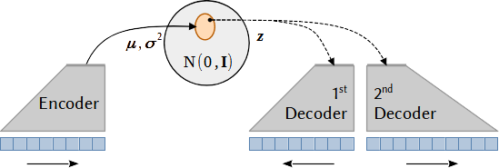

# VAE project



Python module for the implementation of a variational autoencoder (VAE) for climate data. The VAE is a generative model that can be used to learn the underlying distribution of a dataset and to generate new samples from it.

The present methodology extends on the VAE by adding a second decoder to the model. The second decoder is trained to make predictions about the future evolution of the data from the latent space. The VAE is trained to learn the distribution of the data and the prediction decoder is trained to make predictions about the future distribution of the data.

The framework is based on Groth & Chavez (2023). _submitted_.


## Installation

The required packages can be installed with `pip`:

``` shell
pip install -r requirements.txt
```

or with `conda`:

``` shell
conda install --file requirements.txt
```

Download the repository, `cd` into the project directory and install the package with:

```shell
pip install VAE
```

## Requirements

Python 3.9 or higher is required. The following packages are required:

```
python>=3.9
tensorflow>=2.5
numpy
scipy
scikit-learn
pandas
pydot
pyyaml
netCDF4
openpyxl
```

## Documentation

See the [documentation](https://andr-groth.github.io/VAE-project/) for more details.


## Implementations

For applications of the VAE to climate data, see its implementation in the following repositories:

Work in progress ...
- VAE-ENSO
- VAE-SSP
- VAE-precip-predict