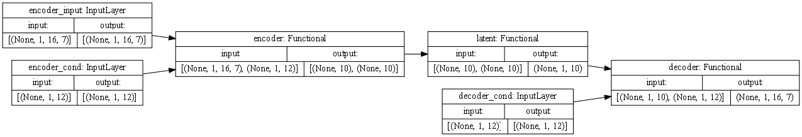

# Example of a VAE model

!!! note ""
    You can find the full code for this example in a [Jupyter notebook](ipynb/example_VAE.ipynb).

This example demonstrates how to build a VAE model using the method `VAE.models.VAE`.

```python linenums="1"
from tensorflow.keras.utils import plot_model

from VAE.models import Encoder, LatentSampling, Decoder, VAE
from VAE.utils import collection
```

We first define the parameters of the model:


```python linenums="5"
params = {
    'encoder_blocks': 1,
    'cond_size': 12,
    'fc_units': 48,
    'filters': 16,
    'input_shape': [16, 7],
    'latent_dim': 10,
    'trainable': ['*bn*'],
}
```

Then we build the different parts of the model. We start with the encoder:


```python linenums="14"
encoder = Encoder(**params, name='encoder')
```

and the latent sampling layer:


```python linenums="15"
latent_sampling = LatentSampling(**params, name='latent')
```

and finally the decoder:


```python linenums="16"
decoder = Decoder(output_shape=params['input_shape'],
                  decoder_blocks=params['encoder_blocks'],
                  output_reverse=True,
                  **params,
                  name='decoder')
```

Once we have the different parts of the model, we can build the full model:


```python linenums="20"
model = VAE(encoder, decoder, latent_sampling, **params, name='VAE')
```

Let's have a look at the model:


```python linenums="21"
model.summary()
```

    Model: "VAE"
    __________________________________________________________________________________________________
    Layer (type)                    Output Shape         Param #     Connected to
    ==================================================================================================
    encoder_input (InputLayer)      [(None, 1, 16, 7)]   0
    __________________________________________________________________________________________________
    encoder_cond (InputLayer)       [(None, 1, 12)]      0
    __________________________________________________________________________________________________
    encoder (Functional)            [(None, 10), (None,  16496       encoder_input[0][0]
                                                                     encoder_cond[0][0]
    __________________________________________________________________________________________________
    latent (Functional)             (None, 1, 10)        0           encoder[0][0]
                                                                     encoder[0][1]
    __________________________________________________________________________________________________
    decoder_cond (InputLayer)       [(None, 1, 12)]      0
    __________________________________________________________________________________________________
    decoder (Functional)            (None, 1, 16, 7)     16243       latent[0][0]
                                                                     decoder_cond[0][0]
    ==================================================================================================
    Total params: 32,739
    Trainable params: 156
    Non-trainable params: 32,583
    __________________________________________________________________________________________________


We can also have a look at the trainable parameters:


```python linenums="22"
collection.summary_trainable(model)
```

    ________________________________________________________________________________
    Layer                                    Type                           # params
    ================================================================================
    VAE                                      Functional                          156
    ________________________________________________________________________________
      encoder                                Functional                           78
        encoder_input_bn                     BatchNormalization                   14
        encoder_block_1                      Functional                           64
          encoder_block_1_R1_bn1             BatchNormalization                   32
          encoder_block_1_R1_bn2             BatchNormalization                   32
    ________________________________________________________________________________
      decoder                                Functional                           78
        decoder_block_1                      Functional                           64
          decoder_block_1_R1_bn1             BatchNormalization                   32
          decoder_block_1_R1_bn2             BatchNormalization                   32
        decoder_output_bn                    BatchNormalization                   14
    ________________________________________________________________________________


and plot the model:


```python linenums="23"
plot_model(model, show_shapes=True, dpi=75, rankdir='LR')
```



