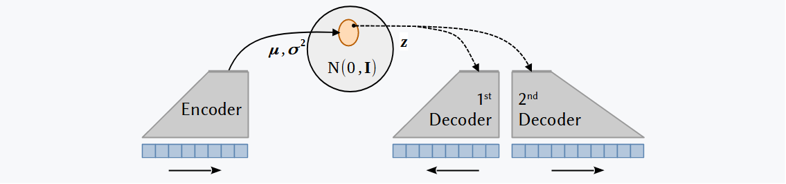

# VAE project

Python module for the implementation of a variational autoencoder (VAE) for climate data. The VAE is a generative model that can be used to learn the underlying distribution of a dataset and to generate new samples from it.

The present methodology extends on the VAE by adding a second decoder to the model. The second decoder is trained to make predictions about the future evolution of the data from the latent space. The VAE is trained to learn the distribution of the data and the prediction decoder is trained to make predictions about the future distribution of the data.

:blue_book: The framework is based on Groth & Chavez (2023). _submitted_.

## Examples

To get started, see the following examples:

- [VAE](example_VAE.md): Build a variational autoencoder model.

- [VAEp](example_VAEp.md): Build a variational autoencoder model with a prediction decoder.

## Implementations

For applications of the VAE package to climate data, see its implementation in the following repositories:

### :warning: Work in progress ...

- VAE-ENSO
- VAE-SSP
- VAE-precip-predict
